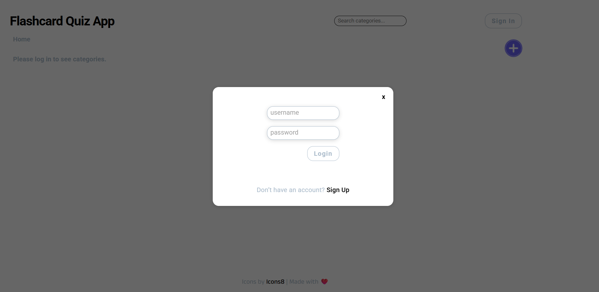
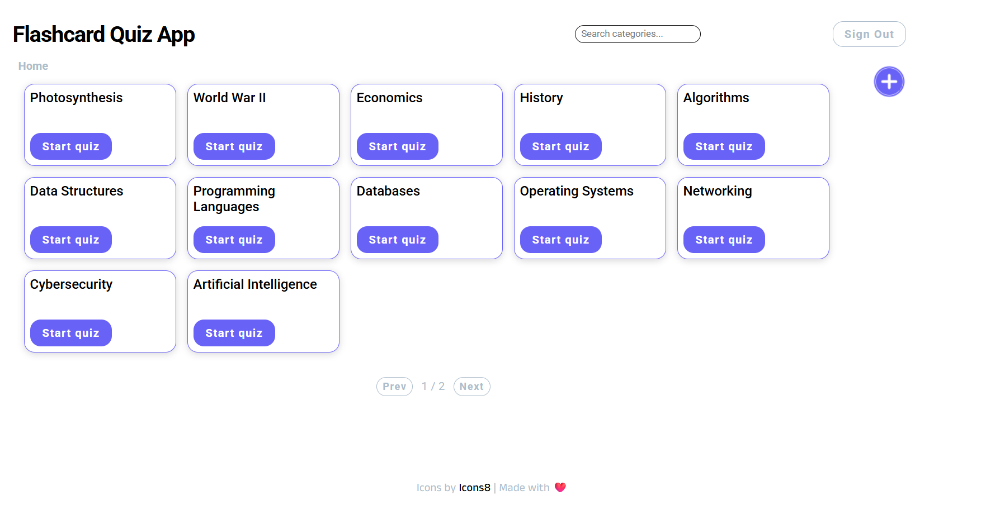
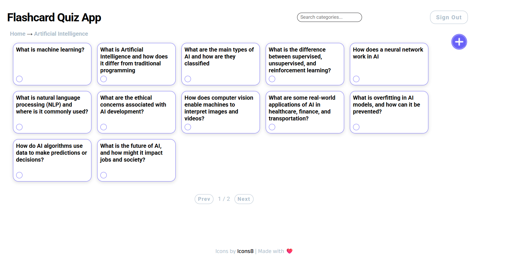
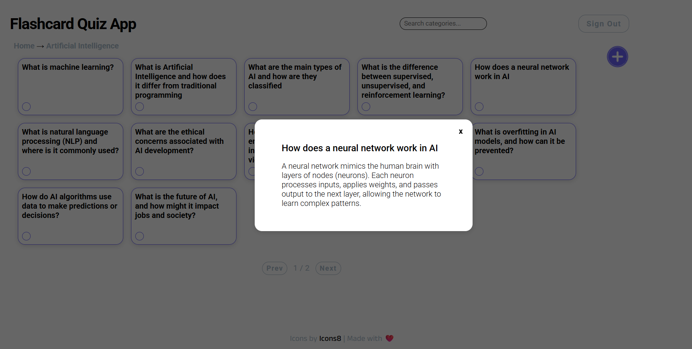

# Flashcard Quiz Project

A flashcard quiz web application built with _React_ and _.NET Web API_, using _SQLite_ as the backend database.

---

## Features

- Manage categories of flashcards
- Add, edit, and delete categories & cards
- Add, edit, and delete questions & answers within cards
- Start quiz on any category
- Context menu for quick edit and delete options
- User registration & login with JWT
- Search categories
- Pagination available for large set of cards

---

## Usage

- On load, categories are fetched from SQLiteDb.
- Click a category to view its flashcards
- Right-click a category or flashcard to see edit/delete options
- Use the "Add" button to add new categories or cards
- Use the "Start Quiz" button to start a quiz on a selected category
- Use the quiz modal to navigate questions and reveal answers

---

## Tech Stack

- **Frontend** React + Axios
- **Backend** .NET Web API + EF Core + SQLite/InMemory
- **Testing** xUnit + Moq

---

## Environment Variables

This project uses .env files for configuration. Both backend and frontend require certain variables to run correctly.

```env
### Backend (src/backend/.env)

JWT_KEY=a-string-secret-at-least-256-bits-long
JWT_ISSUER=flashcard
JWT_AUDIENCE=flashcard-users

### Frontend (src/frontend/.env)
REACT_APP_API_BASE_URL=http://localhost:5001
```

⚠️ Adjust values if your backend runs on a different port or server.

## Getting Started

```bash
### Backend

cd src/backend
dotnet ef database update
dotnet run
```

Swagger UI → http://localhost:5001/swagger

```bash
### Frontend

cd src/frontend
npm install
npm start

### Test

cd src/test
dotnet test
```

Running at → http://localhost:3000

## Screenshots






## API Endpoints

### Auth

- **POST /api/Auth/register**

  - Request:
    ```json
    { "username": "admin", "password": "admin", "role": "admin" }
    ```
  - Response:
    ```json
    { "token": "eyJhbGciOiJ...", "username": "admin_new", "role": "admin" }
    ```

- **POST /api/Auth/login**

  - Request:
    ```json
    { "username": "admin_new", "password": "admin_new" }
    ```
  - Response:
    ```json
    { "token": "eyJhbGciOiJ...", "username": "admin_new", "role": "admin" }
    ```

### Cards

- **POST /api/Cards**

  - Request:
    ```json
    {
      "question": "example",
      "answer": "example",
      "categoryId": 10001
    }
    ```
  - Response:
    401 Error: Unauthorized

### Categories

- **POST /api/Categories**

  - Request:
    ```json
    {
      "name": "example"
    }
    ```
  - Response:
    401 Error: Unauthorized

## License

- This project is open source and available under the MIT License.
